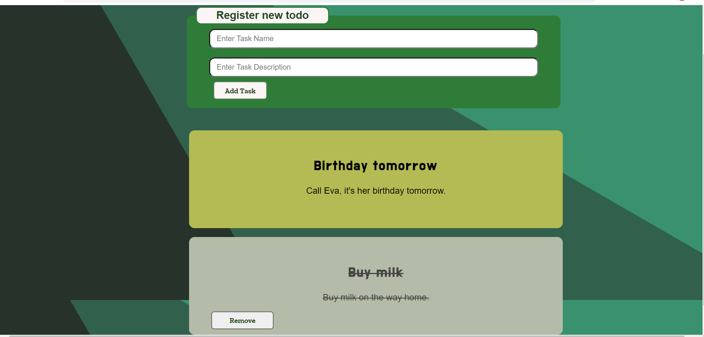

# To-do-list React 

This is a simple classic to-do list exercise  created using the React library.

|  |
|:---:|
| Desktop version |

## Functionalities:
* There is a form input where the user can add a new todo.
* On first load the list of todos is empty.
* When the user submits a new todo from the form the todo card appears in the list.
* Each todo card can be toggleable between 'done' and 'not done'.
* There is a remove-button on the cards that are 'done' and when the user clicks the button it will be removed from the list completely.
* Todo cards which are set to 'done' appear on the bottom of the list, and they are easy to visually separate.
* The original order of the cards is maintained if you toggle a card to 'not done' and then back again.
* It is easy to add, toggle and remove todo's. For example adding a new card by hitting 'enter'
  
## How to use it 
- **Clone the repo: git@github.com:Danijela2019/to-do-list-react.git**
- **Position yourself in the todoreact folder**
- **Install packages: npm install**
- **Run this command in your terminal 'npm start'**
- **View the application in the browser(http://localhost:3000)**
- **Preview of the app is available on Netlify [here](https://todo-react1.netlify.app/)**
